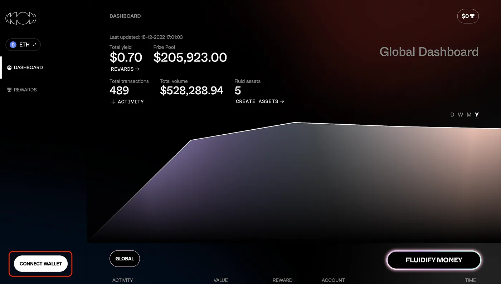

# How to use FluidityPage 1

### 1. **Connect your wallet to the Fluidity webapp**

On the dashboard site, you need to connect your wallet with the button in the bottom left corner. We support Browser based wallets (Metamask) and WalletConnect.

<figure><figcaption>
Connect your wallet with the button in the bottom left corner
</figcaption></figure>

After you have connected your wallet, you will be able to see your own dashboard, your activity, the rewards you have earned so far, and the rewards you are able to claim.\
\

### **2. Fluidify your money! (and add **_**f**_**Tokens to your wallet)**

Next, click on the “FLUIDIFY MONEY” button in the bottom right corner. From there, you will be able to see the assets that you will be able to fluidify (wrap). Click on the little + next to the token to add them to your Metamask.

<figure><figcaption>
Fluidify your money!
</figcaption></figure>

Now, you can choose one of the supported stables (USDC, USDT, DAI, FRAX and TUSD) and drag and drop them into the ring in the middle. After choosing the amount, you can click on “Create Fluid Asset”, and a wallet notification will pop up asking you to confirm the transaction. After confirming, your asset will be wrapped and you will receive the fluid version of it in your wallet. If you wish to exchange your fAssets back for your original assets you’re free to do so at any point in time.

<figure><figcaption>
Choose which stable to fluidify and the amount
</figcaption></figure>

### 3. **Enter the **_**Incentive Layer**_

Finally, you can send and receive fluid transactions normally with your wallet or just use your fluid assets on other protocols. Around every 2nd transaction will be eligible for a reward, so be sure to try it out and earn those rewards! It’s as simple as that.

You can have a look at the rewards page to claim outstanding rewards and look at your history.

## **Bonus** 

4\. **Swapping your fluid assets, providing liquidity**

Go to any of the DEXs we support, and watch as you earn yield while you swap your fluid assets for other tokens. You can also create your own liquidity pools for different fluid asset pairs or add liquidity to existing pairs. If you’re a marketplace or a merchant you can now earn yield just for accepting fluid assets as a form of payment. Feel free to reach out to us regarding integrations!

<figure><figcaption>
Provide liquidity for fluid assets (.- -. -.. ……. . .- .-. -. ……. ..-. .-.. ..- .. -.. ……. … — — — — -.)
</figcaption></figure>


Tweet us screenshots and the tx id of your winnings @fluiditymoney. Who knows, maybe you’ll win more than just those fluid rewards ;)


\
\

\

\
\
